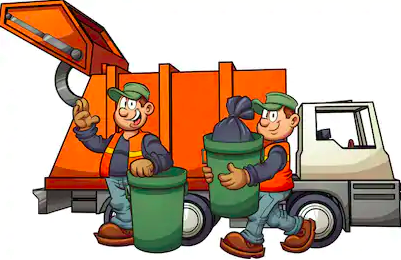

# **Garbage Collection**
  + [Overview](#Garbage-Collection-Overview)
  + [Memory Model](#Memory-Model)

## **Garbage Collection Overview**
  

  One of the most attractive features of Java is that developers needn't explicitly the lifecycle of objects: objects are created when needed, and when the object is no longer in use, the JVM automatically frees the objects.  
  

  At a basic understand, GC consists of finding objects that no longer in use and freezing the memory associated with those objects. The JVM will periodically search the heap for **unreachable objects** - *An object is said to be unreachable if it doesn't contain any reference of it, also note that objects which are part of "*island of isolation*" are also unreachable objects*. When it finds unreachable objects, the JVM can free the memory occupied by those objects and use it to allocate additional objects. However, it is usually insufficient simply to keep track of that free memory and use it for future allocations; at some point, memory must be coalesced to prevent memory fragmentation.
    

      <image width="480" height="360" src="_Images/GC_1.png">
    

  When GC tracks object references or moves objects around in memory, it must make sure that application threads are not using those objects. This is particularly true when GC moves objects around: the memory location of the object changes during that operation, and hence no application threads can be accessing the object. The pauses when all application threads are stopped are called **stop-the-world** pauses. `These pauses generally have the greatest impact on the performance of an application, and minimizing those pauses is the key consideration when tuning GC.`

## **Memory Model**